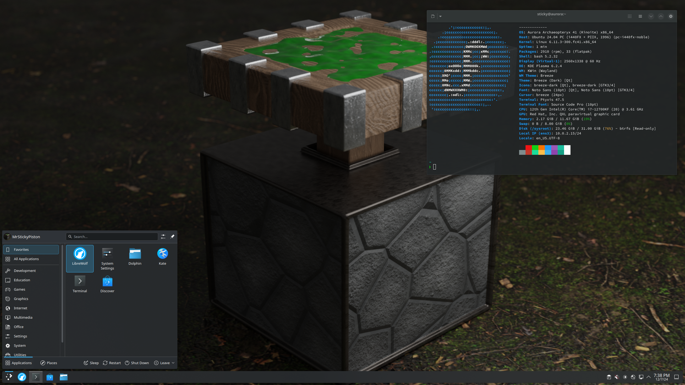

# Personal Aurora

A tweaked version pf Ublue Aurora with personalized default settings, wallpapers, themes and more.

## Features
- All features of `aurora-stable-dx-nvidia`

- Flatpak
    - Added:
        - Librewolf
        - Libreoffice
        - OBS studio

        - Discord
        - Element
        - Prismlauncher
        
    - Removed:
        - Firefox
        - Thunderbird

        - DejaDup

        - KClock
        - Kontact
        - KWeather

- Customization
    - Plasma theme: Breeze dark
    - Sound theme: Oxygen

    - Sticky Piston wallpaper (2000x1500)
        - Desktop
        - Lock screen
        - SDDM

    - Profile pictures
        - Sticky Piston

    - Fastfetch logo: fedora
    - Grub boot splash: spinner

    - Visual studio code:
        - Dialog style: custom (blends better with the vscode window)
        - Telemtry: off
        - Autosave: on
        - Git smart commit: on
        - Confirm git sync: off
        - Auto fetch git: on

    - Ptyxis
        - icon: utilities-terminal
        - Audible bell: off
        - Visual bell: off

- rpm-ostree packages
    - Added:
        - oxygen-sounds


## Using the image
### Aurora setup
Download the official Aurora ISO below and verify that the ISO is valid by comparing the checksum.  
[Aurora ISO](https://dl.getaurora.dev/aurora-stable.iso)  
[Checksum](https://dl.getaurora.dev/aurora-stable.iso-CHECKSUM)  
Install the ISO using a USB drive.

### Rebasing
Run the following command to rebase to Personal Aurora:
```sh
rpm-ostree rebase ostree-image-signed:docker://ghcr.io/mrstickypiston/personal-aurora:latest
```
When the rebase is done you can reboot the system and after that run the following command to apply the configuration changes:
```sh
personalize-config
sudo personalize-system
```
After that Personal Aurora is ready for usage and will be updated automatically.